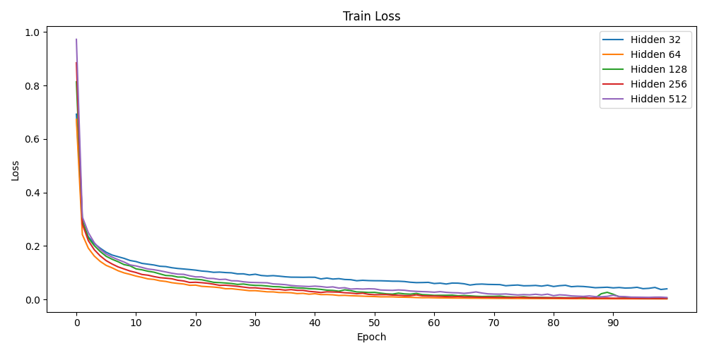

# MNIST Classification with MLP and CNN from Scratch

## Requirements

- Python 3.9
- NumPy
- TorchVision (for loading MNIST dataset)

Install dependencies:
```bash
pip install numpy torch torchvision
```

## Repository Structure

```
├── CNN_3.py          # CNN training script
├── MLP_3.py          # MLP training script
├── cnn_results/      # CNN saved models and plots
├── mlp_results/      # MLP saved models and plots
├── data/             # MNIST dataset (auto-downloaded)
└── README.md
```

## How to Run

Train MLP:
```bash
python MLP_3.py
```

Train CNN:
```bash
python CNN_3.py
```

## Results for tuning `hidden_size` in MLP:




## Results for tuning `kernel_size` in CNN:


## How to Load Saved Model Parameters

Each model provides a `load_model_params(filepath)` function.
Example for loading a trained MLP model:
```python
model.load_model_params("mlp_results/mlp_params_256.npz")
```
Example for loading a trained CNN model:
```python
model.load_model_params("cnn_results/cnn_params_7.npz")
```

## Notes

- Losses and accuracies are saved automatically as `.npy` files.
- Trained model parameters are saved as `.npz` files inside `cnn_results/` and `mlp_results/`.

