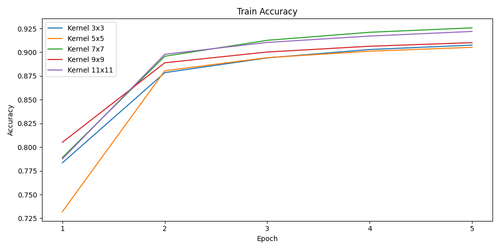

# Implementation of MNIST Classification Using Multilayer Perceptron and Convolutional Neural Networks

## Introduction to Deep Learning CS4851/6851 - Dr. Yue Wang

### Reza Mansouri `rmansouri1[at]student.gsu.edu`
### Pranjal Patil `ppatil8[at]student.gsu.edu`
### Ven Mendelssohn `gmendelssohn1[at]student.gsu.edu`
$$
    x=2
$$
## 1. Introduction

### 1.1 Background and Motivation
Deep learning has revolutionized fields such as computer vision, natural language processing, and signal processing. Among its many architectures, **Multilayer Perceptron (MLP)** and **Convolutional Neural Network (CNN)** are foundational. MLPs serve as universal function approximators, while CNNs excel in spatial data processing, especially image classification.

This project explores the construction of both MLP and CNN models **from scratch using only NumPy**. By re-implementing these architectures without relying on high-level libraries like PyTorch or TensorFlow, we gain a deeper understanding of how data flows through layers and how gradients are propagated during learning.

### 1.2 Problem Definition
Our task is to classify handwritten digits from the MNIST dataset using two approaches:
- A fully connected MLP with one hidden layer.
- A CNN incorporating convolutional and fully connected layers.

### 1.3 System Overview
The system includes the following components:
1. **Data preprocessing** using TorchVision, normalization, and batching.
2. **MLP implementation:** input layer, one hidden layer, and an output softmax layer.
3. **CNN implementation:** convolution, activation, flattening, and a fully connected output layer.
4. **Manual backpropagation** for both architectures, with weight updates using vanilla gradient descent.
5. **Evaluation** of model performance on the MNIST test subset.

---

## 2. Methodology

### 2.1 MLP

#### 2.1.1 Architecture

The MLP processes a flattened 784-dimensional input (28×28 image) through:

- One hidden layer with a variable number of neurons,
- An output layer with 10 neurons,
- Sigmoid activation in the hidden layer and softmax activation in the output layer.

**MLP Forward Pass:**
w
```python
def forward(self, x):
    self.hidden_layer_input = np.dot(x, self.weights1) + self.bias1
    self.hidden_layer_output = sigmoid(self.hidden_layer_input)
    self.output_layer_input = np.dot(self.hidden_layer_output, self.weights2) + self.bias2
    outputs = softmax(self.output_layer_input)
    return outputs
```

Remarks:

- Proper initialization of weights helps avoid vanishing gradients when using sigmoid.
- The hidden layer activation is sigmoid, which can saturate if not carefully tuned.

**MLP Backward Pass:**

```python
def backward(self, x, y, pred):
    one_hot_y = np.eye(self.output_size)[y]
    d_output = pred - one_hot_y
    d_weights2 = np.dot(self.hidden_layer_output.T, d_output)
    d_bias2 = np.sum(d_output, axis=0)
    d_hidden = np.dot(d_output, self.weights2.T) * (self.hidden_layer_output * (1 - self.hidden_layer_output))
    d_weights1 = np.dot(x.T, d_hidden)
    d_bias1 = np.sum(d_hidden, axis=0)

    self.weights2 -= self.lr * d_weights2
    self.bias2 -= self.lr * d_bias2
    self.weights1 -= self.lr * d_weights1
    self.bias1 -= self.lr * d_bias1
```

Remarks:

- Correct computation of the derivative of the sigmoid function is essential for stable training.
- One-hot encoding must match the softmax output dimensions to compute loss gradients properly.

Example `MLP_3.py` output with hidden size = 256:

```
The number of training data: 60000
The number of testing data: 10000
Epoch 1/100, Train Loss: 0.8850 Train Accuracy: 0.7027
Epoch 2/100, Train Loss: 0.2825 Train Accuracy: 0.9169
Epoch 3/100, Train Loss: 0.2201 Train Accuracy: 0.9349
Epoch 4/100, Train Loss: 0.1861 Train Accuracy: 0.9439
Epoch 5/100, Train Loss: 0.1630 Train Accuracy: 0.9516
...
Epoch 96/100, Train Loss: 0.0044 Train Accuracy: 0.9997
Epoch 97/100, Train Loss: 0.0042 Train Accuracy: 0.9997
Epoch 98/100, Train Loss: 0.0042 Train Accuracy: 0.9997
Epoch 99/100, Train Loss: 0.0041 Train Accuracy: 0.9997
Epoch 100/100, Train Loss: 0.0041 Train Accuracy: 0.9997
Test Accuracy: 0.9701
```

#### 2.1.2 Gradient computaion

We consider a standard Multilayer Perceptron (MLP) with:
- Input: $ \mathbf{x} \in \mathbb{R}^{d} $ (flattened image vector of size 784)
- Hidden layer: weights $ \mathbf{W}_1 \in \mathbb{R}^{d \times h} $, bias $ \mathbf{b}_1 \in \mathbb{R}^{h} $
- Activation: sigmoid function $ \sigma(z) = \frac{1}{1 + e^{-z}} $
- Output layer: weights $ \mathbf{W}_2 \in \mathbb{R}^{h \times 10} $, bias $ \mathbf{b}_2 \in \mathbb{R}^{10} $
- Output activation: softmax

The model computes:
$$
\mathbf{z}_1 = \mathbf{x} \mathbf{W}_1 + \mathbf{b}_1
$$
$$
\mathbf{h} = \sigma(\mathbf{z}_1)
$$
$$
\mathbf{z}_2 = \mathbf{h} \mathbf{W}_2 + \mathbf{b}_2
$$
$$
\hat{\mathbf{y}} = \text{softmax}(\mathbf{z}_2)
$$

where $ \hat{\mathbf{y}} $ is the predicted probability distribution over 10 classes.

The loss is cross-entropy:
$$
L = -\sum_{i=1}^{10} y_i \log(\hat{y}_i)
$$
where $ \mathbf{y} $ is the true one-hot encoded label vector.

---

##### Step 1: Derivative of Loss w.r.t. Output Logits

For softmax + cross-entropy, the derivative simplifies to:
$$
\frac{\partial L}{\partial \mathbf{z}_2} = \hat{\mathbf{y}} - \mathbf{y}
$$

This gives the error at the output layer directly.

---

##### Step 2: Gradients for Output Layer Parameters

Compute gradients of the loss with respect to the second layer weights $ \mathbf{W}_2 $ and bias $ \mathbf{b}_2 $:

- Gradient w.r.t. $ \mathbf{W}_2 $:
$$
\frac{\partial L}{\partial \mathbf{W}_2} = \mathbf{h}^\top (\hat{\mathbf{y}} - \mathbf{y})
$$

- Gradient w.r.t. $ \mathbf{b}_2 $:
$$
\frac{\partial L}{\partial \mathbf{b}_2} = \hat{\mathbf{y}} - \mathbf{y}
$$

where $ \mathbf{h} $ is the hidden layer output (after sigmoid activation).

---

##### Step 3: Backpropagate Through Hidden Layer

Compute the gradient flowing into the hidden layer:

- First, backpropagate through $ \mathbf{z}_2 $:
$$
\frac{\partial L}{\partial \mathbf{h}} = (\hat{\mathbf{y}} - \mathbf{y}) \mathbf{W}_2^\top
$$

- Then, account for the sigmoid activation derivative:
The derivative of sigmoid is:
$$
\sigma'(z) = \sigma(z)(1 - \sigma(z))
$$

Thus:
$$
\frac{\partial L}{\partial \mathbf{z}_1} = \frac{\partial L}{\partial \mathbf{h}} \odot \sigma(\mathbf{z}_1) (1 - \sigma(\mathbf{z}_1))
$$
where $ \odot $ denotes element-wise (Hadamard) product.

---

##### Step 4: Gradients for Hidden Layer Parameters

Compute gradients of the loss with respect to the first layer weights $ \mathbf{W}_1 $ and bias $ \mathbf{b}_1 $:

- Gradient w.r.t. $ \mathbf{W}_1 $:
$$
\frac{\partial L}{\partial \mathbf{W}_1} = \mathbf{x}^\top \left( \frac{\partial L}{\partial \mathbf{z}_1} \right)
$$

- Gradient w.r.t. $ \mathbf{b}_1 $:
$$
\frac{\partial L}{\partial \mathbf{b}_1} = \frac{\partial L}{\partial \mathbf{z}_1}
$$

---

##### Step 5: Summary of Update Rules

After computing all gradients, the parameters are updated using gradient descent:

- Update weights and biases:
$$
\mathbf{W}_2 \leftarrow \mathbf{W}_2 - \eta \frac{\partial L}{\partial \mathbf{W}_2}
$$
$$
\mathbf{b}_2 \leftarrow \mathbf{b}_2 - \eta \frac{\partial L}{\partial \mathbf{b}_2}
$$
$$
\mathbf{W}_1 \leftarrow \mathbf{W}_1 - \eta \frac{\partial L}{\partial \mathbf{W}_1}
$$
$$
\mathbf{b}_1 \leftarrow \mathbf{b}_1 - \eta \frac{\partial L}{\partial \mathbf{b}_1}
$$

where $ \eta $ is the learning rate.

---

### Key Remarks:
- The softmax + cross-entropy derivative simplifies the first step: no need to compute softmax derivative separately.
- Proper handling of element-wise derivatives of the sigmoid activation is critical to avoid incorrect gradient shapes.
- All computations assume batch mode: $ \mathbf{x} $ can represent multiple samples at once.


---

### 2.2 CNN

#### 2.2.1 Architecture

The CNN model processes a 28×28 grayscale image through:

- A single convolutional layer with multiple filters,
- ReLU activation after convolution,
- Flattening,
- A fully connected layer with 10 outputs.

No pooling operation is used; convolution alone reduces spatial dimensions.

**CNN Forward Pass:**

```python
def forward(self, x):
    self.x = x
    self.conv = self.convolve(x, self.filters)
    self.relu = relu(self.conv)
    self.flat = self.relu.reshape(x.shape[0], -1)
    self.logits = np.dot(self.flat, self.fc_weights) + self.fc_bias
    self.probs = softmax(self.logits)
    return self.probs
```

Remarks:

- Without pooling, the convolution operation itself is responsible for reducing spatial dimensions.
- ReLU activation prevents vanishing gradients and accelerates training.

**Vectorized CNN Convolution (Efficient Implementation):**

```python
def convolve(self, x, filters):
    B, _, H, W = x.shape
    F, _, KH, KW = filters.shape
    OH, OW = H - KH + 1, W - KW + 1
    patches = np.lib.stride_tricks.as_strided(
        x,
        shape=(B, OH, OW, KH, KW),
        strides=(x.strides[0], x.strides[2], x.strides[3], x.strides[2], x.strides[3]),
        writeable=False
    ).reshape(B, OH * OW, KH * KW)
    filters_flat = filters.reshape(F, KH * KW)
    out = np.matmul(patches, filters_flat.T)
    return out.transpose(0, 2, 1).reshape(B, F, OH, OW)
```
Remarks:

- The convolution operation is transformed into a batch matrix multiplication by unfolding local patches into rows ("im2col" style) and reshaping filters into rows. Each patch becomes a vector.
- Mathematically, if `x_patch` has shape `(B, OH*OW, KH*KW)` and `filters_flat` has shape `(F, KH*KW)`, then:

$ output[b, :, i] = filters \times x\_patch[b, i]^T $

where $ x\_patch[b, i] $ is the flattened receptive field.
- This avoids costly nested loops over batch, filters, and spatial dimensions.

**CNN Backward Pass:**

```python
def backward(self, x, y, pred):
    B = y.shape[0]
    y_onehot = np.eye(self.fc_output_size)[y]
    d_logits = (pred - y_onehot) / B

    d_fc_weights = np.dot(self.flat.T, d_logits)
    d_fc_bias = np.sum(d_logits, axis=0)
    d_flat = np.dot(d_logits, self.fc_weights.T)
    d_relu = d_flat.reshape(self.relu.shape)
    d_conv = d_relu * (self.conv > 0)

    B, F, OH, OW = d_conv.shape
    patches = np.lib.stride_tricks.as_strided(
        self.x,
        shape=(B, OH, OW, self.kernel_size, self.kernel_size),
        strides=(self.x.strides[0], self.x.strides[2], self.x.strides[3], self.x.strides[2], self.x.strides[3]),
        writeable=False
    ).reshape(B, OH * OW, self.kernel_size * self.kernel_size)

    d_out_flat = d_conv.reshape(B, F, OH * OW)

    d_filters = np.zeros_like(self.filters)
    for b in range(B):
        d_filters += np.matmul(d_out_flat[b], patches[b]).reshape(F, 1, self.kernel_size, self.kernel_size)

    self.fc_weights -= self.lr * d_fc_weights
    self.fc_bias -= self.lr * d_fc_bias
    self.filters -= self.lr * d_filters
```
Remarks:

- During backpropagation, output gradients `d_conv` are reshaped to align with the patch matrix.
- The filter gradient is efficiently computed using:

$ \Delta W = \sum_b d\_out[b] \times x\_patch[b] $

where `d_out[b]` is the output gradient for batch `b` reshaped as `(F, OH*OW)`, and `x_patch[b]` is the local receptive fields.
- This matrix multiplication accumulates gradients for all patches and batches simultaneously, maintaining full batch parallelism.

Example `CNN_3.py` output with kernel size = 7:

```
Training samples: 60000
Testing samples: 10000
Epoch 1/5, Train Loss: 0.6728 Train Accuracy: 0.7876
Epoch 2/5, Train Loss: 0.3537 Train Accuracy: 0.8979
Epoch 3/5, Train Loss: 0.3120 Train Accuracy: 0.9103
Epoch 4/5, Train Loss: 0.2893 Train Accuracy: 0.9170
Epoch 5/5, Train Loss: 0.2736 Train Accuracy: 0.9219
Test Accuracy: 0.9252
```
### 2.2.2 Gradient computation

We consider a simple CNN with:
- Input: $ \mathbf{x} \in \mathbb{R}^{B \times 1 \times H \times W} $ (batch of grayscale images)
- Convolutional layer: filters $ \mathbf{W}_{\text{conv}} \in \mathbb{R}^{F \times 1 \times K \times K} $ (F filters of size $ K \times K $)
- Activation: ReLU
- Fully connected layer: weights $ \mathbf{W}_{\text{fc}} \in \mathbb{R}^{d \times 10} $ where $ d $ is the flattened size after convolution
- Output activation: softmax

The model computes:
1. **Convolution**:
$$
\mathbf{z}_{\text{conv}} = \text{conv2d}(\mathbf{x}, \mathbf{W}_{\text{conv}})
$$
2. **ReLU Activation**:
$$
\mathbf{h}_{\text{conv}} = \text{ReLU}(\mathbf{z}_{\text{conv}})
$$
3. **Flattening**:
$$
\mathbf{h}_{\text{flat}} = \text{flatten}(\mathbf{h}_{\text{conv}})
$$
4. **Fully Connected Layer**:
$$
\mathbf{z}_{\text{fc}} = \mathbf{h}_{\text{flat}} \mathbf{W}_{\text{fc}} + \mathbf{b}_{\text{fc}}
$$
5. **Softmax Output**:
$$
\hat{\mathbf{y}} = \text{softmax}(\mathbf{z}_{\text{fc}})
$$

The loss is cross-entropy:
$$
L = -\sum_{i=1}^{10} y_i \log(\hat{y}_i)
$$

---

##### Step 1: Derivative of Loss w.r.t. FC Output

Same as in MLP:
$$
\frac{\partial L}{\partial \mathbf{z}_{\text{fc}}} = \hat{\mathbf{y}} - \mathbf{y}
$$

---

##### Step 2: Gradients for Fully Connected Layer

- Gradient w.r.t. FC weights:
$$
\frac{\partial L}{\partial \mathbf{W}_{\text{fc}}} = \mathbf{h}_{\text{flat}}^\top (\hat{\mathbf{y}} - \mathbf{y})
$$

- Gradient w.r.t. FC bias:
$$
\frac{\partial L}{\partial \mathbf{b}_{\text{fc}}} = \hat{\mathbf{y}} - \mathbf{y}
$$

- Backpropagate into the flattened feature map:
$$
\frac{\partial L}{\partial \mathbf{h}_{\text{flat}}} = (\hat{\mathbf{y}} - \mathbf{y}) \mathbf{W}_{\text{fc}}^\top
$$

---

##### Step 3: Reshape and Backpropagate Through ReLU

Reshape:
$$
\frac{\partial L}{\partial \mathbf{h}_{\text{conv}}} = \text{reshape}\left( \frac{\partial L}{\partial \mathbf{h}_{\text{flat}}} \right)
$$

Backpropagate through ReLU:
$$
\frac{\partial L}{\partial \mathbf{z}_{\text{conv}}} = \frac{\partial L}{\partial \mathbf{h}_{\text{conv}}} \odot \mathbf{1}_{\mathbf{z}_{\text{conv}} > 0}
$$

where $ \mathbf{1}_{\mathbf{z}_{\text{conv}} > 0} $ is an indicator function that is 1 where $ \mathbf{z}_{\text{conv}} $ was positive and 0 elsewhere.

---

##### Step 4: Gradients for Convolutional Filters

At this point, we need to compute the gradient of the loss with respect to the convolution filters.

Using vectorized notation:

Let:
- $ \mathbf{P} $ be the matrix of extracted patches from $ \mathbf{x} $, with shape $ (B, OH \times OW, K \times K) $
- $ \delta_{\text{conv}} = \frac{\partial L}{\partial \mathbf{z}_{\text{conv}}} $, reshaped as $ (B, F, OH \times OW) $

Then, for each batch $ b $, the gradient for convolutional filters is:

$$
\Delta \mathbf{W}_{\text{conv}} = \sum_{b=1}^B \delta_{\text{conv}}[b] \times \mathbf{P}[b]
$$

Specifically:
- Multiply each $ (F, OH \times OW) $ gradient slice with the corresponding $ (OH \times OW, K \times K) $ patch slice.
- Resulting in a $ (F, K, K) $ tensor.

Summed over the batch.

---

##### Step 5: Summary of Update Rules

The parameters are updated using gradient descent:

- Update FC layer:
$$
\mathbf{W}_{\text{fc}} \leftarrow \mathbf{W}_{\text{fc}} - \eta \frac{\partial L}{\partial \mathbf{W}_{\text{fc}}}
$$
$$
\mathbf{b}_{\text{fc}} \leftarrow \mathbf{b}_{\text{fc}} - \eta \frac{\partial L}{\partial \mathbf{b}_{\text{fc}}}
$$

- Update convolutional filters:
$$
\mathbf{W}_{\text{conv}} \leftarrow \mathbf{W}_{\text{conv}} - \eta \Delta \mathbf{W}_{\text{conv}}
$$

where $ \eta $ is the learning rate.

---

### Key Remarks:
- Convolution backpropagation is efficiently computed by reshaping the input into patches (im2col), and using matrix multiplication to compute gradients.
- ReLU activation masks the gradient, ensuring only the active neurons propagate gradients backward.
- The spatial dimensions shrink in the forward convolution (valid convolution), so the backpropagated gradients must align carefully with reduced sizes.
- Efficient batch matrix multiplications allow computing all filter updates across the batch without explicit nested loops.

## 3. Evaluation

### 3.1 Experiment Settings

- **Data**: 60,000 training and 10,000 testing images from MNIST
- **MLP**: 784-input, one hidden layer with varying sizes, 10-output, softmax
- **Learning rate**: 0.01
- **Batch size**: 128
- **CNN**: 28x28-input, one convolution kernel with varying sizes, ReLU, FC(10)
- **Epochs**:
    - **MLP**: 100
    - **CNN**: 5

We performed multiple experiments on the MLP architecture by varying the `hidden_size` parameter to understand its effect on model performance.

The five values tested for `hidden_size` were: **32, 64, 128, 256, 512**.

---

### 3.2 MLP Learning Curves

Below are the training loss and accuracy plots for each hidden size:


### 3.3 CNN Learning Curves

Below are the training loss and accuracy plots for each hidden size:




### 3.4 MLP Accuracy Results

The table below shows test set accuracy for each `hidden_size` value:

| Hidden Layer Size | Test Accuracy |
|-------------------|---------------|
| 32                | 95.69%        |
| 64                |   96.94%      |
| 128               |   96.79%      |
| 256               |  ***97.01%*** |
| 512               |    96.40%     |

We found that increasing the hidden layer size generally improved accuracy, but performance plateaued beyond 256. The best result was obtained with `hidden_size = 256`.


### 3.5 CNN Accuracy Results

The table below shows test set accuracy for each `kernel_size` value:

| Kernel Size | Test Accuracy |
|-------------------|---------------|
| 3 x 3                | 91.16%        |
| 5 x 5                |   90.47%      |
| 7 x 7               |   ***92.77%***      |
| 9 x 9               |  91.29%      |
| 11 x 11               |    92.52%     |

As can be seen, the best result was obtained with `kernel_size = 7`.

---

## 4. Learning Outcomes

### 4.1 Tasks Accomplished

- Implemented both MLP and CNN architectures from scratch in NumPy.
- Derived and implemented full forward and backward propagation manually.
- Designed a full training and evaluation pipeline.
- Gained practical experience debugging gradient flow in neural nets.

### 4.2 Team Contributions

This project was a team effort by three members:

- **Reza Mansouri**: Developed the convolutional operation and CNN backpropagation logic.
- **Pranjal Patil**: Implemented the MLP architecture and trained both models.
- **Ven Mendelssohn**: Wrote the training/evaluation scripts and composed the final report.

All members contributed to testing, debugging, and system integration.

### 4.3 Challenges and Lessons Learned

- Implementing convolutional backpropagation without autograd was complex.
- Proper memory management and vectorization were crucial for speed.
- Manual implementation helped us understand how modern frameworks work under the hood.

### 4.4 Conclusion

Rebuilding MLP and CNN architectures from scratch allowed us to deeply understand the fundamental building blocks of deep learning. From activation functions to convolution operations, every detail required precise implementation and validation. Manually constructing and optimizing both models also highlighted the critical roles of proper initialization, gradient flow, and efficient computation. This project not only enhanced our confidence in the theory and application of deep learning models but also provided a strong foundation for further exploration into modern deep learning frameworks.